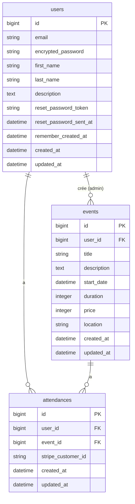
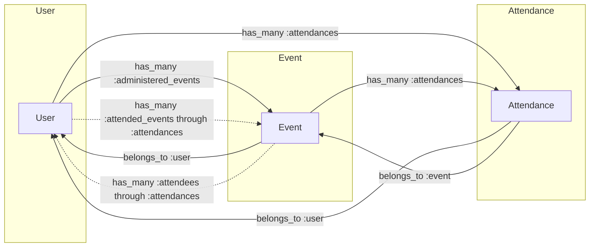
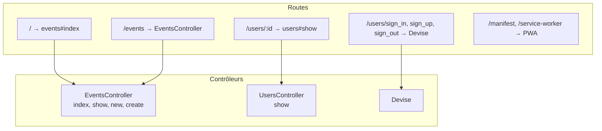
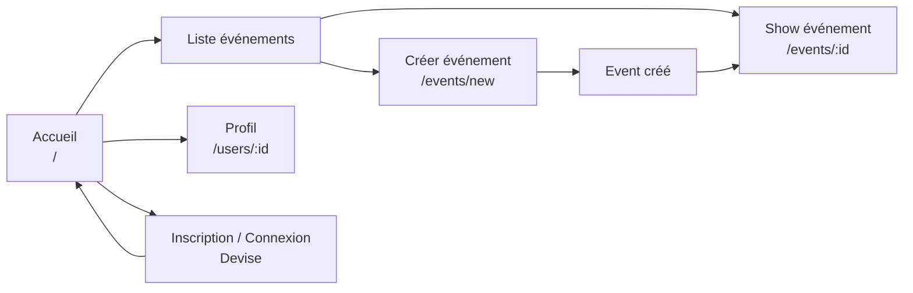

# Schémas Mermaid – Eventbrite

## 1. Modèle de données (entités et associations)

```mermaid
erDiagram
  users ||--o{ events : "crée (admin)"
  users ||--o{ attendances : "a"
  events ||--o{ attendances : "a"

  users {
    bigint id PK
    string email
    string encrypted_password
    string first_name
    string last_name
    text description
    string reset_password_token
    datetime reset_password_sent_at
    datetime remember_created_at
    datetime created_at
    datetime updated_at
  }

  events {
    bigint id PK
    bigint user_id FK
    string title
    text description
    datetime start_date
    integer duration
    integer price
    string location
    datetime created_at
    datetime updated_at
  }

  attendances {
    bigint id PK
    bigint user_id FK
    bigint event_id FK
    string stripe_customer_id
    datetime created_at
    datetime updated_at
  }
```

## 2. Associations (modèles Rails)

```mermaid
flowchart LR
  subgraph User
    U[User]
  end

  subgraph Event
    E[Event]
  end

  subgraph Attendance
    A[Attendance]
  end

  U -->|"has_many :administered_events"| E
  E -->|"belongs_to :user"| U
  U -->|"has_many :attendances"| A
  A -->|"belongs_to :user"| U
  E -->|"has_many :attendances"| A
  A -->|"belongs_to :event"| E
  U -.->|"has_many :attended_events through :attendances"| E
  E -.->|"has_many :attendees through :attendances"| U
```

## 3. Routes et contrôleurs

```mermaid
flowchart TB
  subgraph Routes
    R1["/ → events#index"]
    R2["/events → EventsController"]
    R3["/users/:id → users#show"]
    R4["/users/sign_in, sign_up, sign_out → Devise"]
    R5["/manifest, /service-worker → PWA"]
  end

  subgraph Contrôleurs
    EC[EventsController\nindex, show, new, create]
    UC[UsersController\nshow]
    DC[Devise]
  end

  R1 --> EC
  R2 --> EC
  R3 --> UC
  R4 --> DC
```

## 4. Flux utilisateur (pages principales)

```mermaid
flowchart LR
  A[Accueil\n/] --> B[Liste événements]
  B --> C[Show événement\n/events/:id]
  B --> D[Créer événement\n/events/new]
  D --> E[Event créé]
  E --> C
  A --> F[Profil\n/users/:id]
  A --> G[Inscription / Connexion\nDevise]
  G --> A
```
